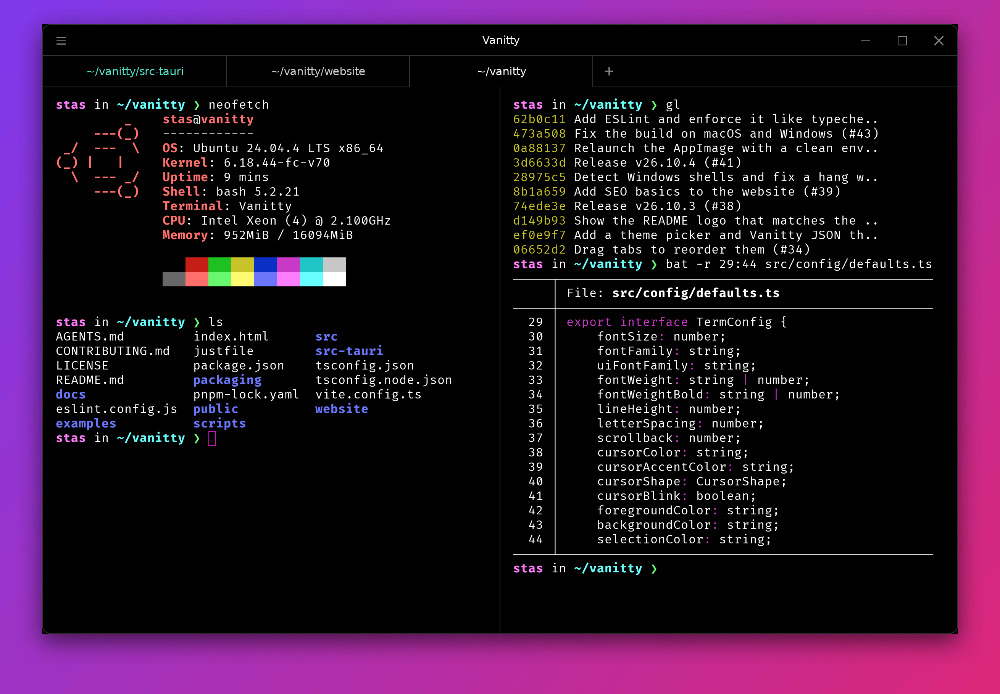

<p align="center">
  
  
</p>

<p align="center">A fast, native terminal built with Rust and Tauri.</p>

<p align="center"></p>

## Features

- Tabs (drag to reorder), split panes (drag dividers, double-click to even them out), pane and tab navigation
- Search in scrollback (case, whole word, regex)
- Clickable links, Cmd/Ctrl+Click to open file paths and `ssh://` links (asks first), inline images, Unicode 11 widths, WebGL rendering
- Ships with FiraCode Nerd Font Mono, with ligatures (`disableLigatures` turns them off)
- Profiles: per-profile shell, args, env and colors, picked from the new-tab menu
- New tabs and splits open in the current directory (`preserveCWD`, macOS and Linux)
- Zoom, full screen, always on top, copy on select, quick edit, bell sound
- Programs like tmux, vim and remote shells can copy to your clipboard (OSC 52)
- Drag files onto a terminal to paste their paths
- Shell > Reopen Last Session brings back your windows, tabs, splits, folders and terminal text (<kbd>⌘⇧T</kbd>, <kbd>Ctrl+Shift+Alt+T</kbd> on Linux and Windows). Press it again for the session before; the last five are kept. Set `restoreSession` to reopen them on every launch. Window size is remembered too.
- Saved layouts: Shell > Save Layout… names this window's tabs, splits and folders, and Shell > Open Layout… (<kbd>⌘⇧L</kbd>, <kbd>Ctrl+Shift+L</kbd> on Linux and Windows) opens one again with fresh shells. They live in `layouts.json` next to your settings.
- Rounded, frameless window on Linux and Windows; native rounded window on macOS
- Theme picker (Settings > Change Theme…) with built-in themes, your own JSON themes and reviewed Hyper themes; Hyper themes from npm run in a sandbox
- Sandboxed JS plugins ([docs/plugins.md](docs/plugins.md))

## Install

**macOS and Linux**

```sh
curl -fsSL https://vanitty.dev/install.sh | sh
```

**Windows** (PowerShell)

```powershell
irm https://vanitty.dev/install.ps1 | iex
```

The script downloads the latest release, checks its SHA-256 and installs it: `Vanitty.app` in `/Applications` on macOS, the AppImage in `~/.local/share/vanitty` with a menu entry and a `vanitty` command on Linux (no root needed), and the per-user installer on Windows. Run the macOS/Linux script with `sh -s -- --uninstall` to remove Vanitty; on Windows use Settings > Apps.

Vanitty then updates itself in the background and shows a "Restart to update" notice when a new version is ready. Set `"disableAutoUpdates": true` in your settings to turn that off.

### Manual download

Every [release](https://github.com/stasadance/vanitty/releases/latest) has:

| Platform                        | Files                           |
| ------------------------------- | ------------------------------- |
| Windows                         | `.exe` (per-user setup), `.msi` |
| macOS (Apple Silicon and Intel) | `.dmg`                          |
| Debian, Ubuntu                  | `.deb`                          |
| Fedora, openSUSE                | `.rpm`                          |
| Any Linux                       | `.AppImage`                     |

The macOS build isn't notarized yet, so macOS blocks a downloaded `.dmg` on first launch (the install script avoids this). After moving Vanitty to Applications, either open it once, then click **Open Anyway** in System Settings > Privacy & Security, or run:

```sh
xattr -dr com.apple.quarantine /Applications/Vanitty.app
```

### Arch Linux

Build the package from the repo:

```sh
cd packaging/arch
makepkg -si
```

### From source

```sh
cargo install vanitty
```

Needs Rust and the [Tauri prerequisites](https://tauri.app/start/prerequisites/). Builds from source don't update themselves.

## Command line

```sh
vanitty               # new tab in the current folder
vanitty ~/code        # new tab in ~/code
vanitty -w .          # new window instead of a tab
vanitty -- htop       # run htop in a new tab
```

It opens the tab in the Vanitty window you used last, or starts Vanitty. Linux installs put `vanitty` on your PATH, and so does the Windows setup `.exe` (not the `.msi`). On macOS, choose **Vanitty > Install vanitty Command…**.

## Settings

Settings live in `~/.config/vanitty` (`%APPDATA%\Vanitty` on Windows, or `$XDG_CONFIG_HOME/vanitty`):

- `settings.json` takes the same options as Hyper's `config`, as JSON with comments. A JSON schema sits next to it, so VS Code autocompletes and validates it.
- `keybindings.json` works like VS Code's: `{ "key": "ctrl+shift+t", "command": "tab:new" }`, and `"-tab:new"` removes a default. Command names are Hyper's. "Settings > Show Default Keybindings" lists them all.

Both reload as soon as you save. On first run, Vanitty imports your Hyper config (`hyper.json` or `.hyper.js`) if it finds one; "Settings > Import Hyper Config" does it again later.

### Themes

"Settings > Change Theme…" lists built-in themes, your own, and reviewed Hyper themes pinned to a checked version, plus the rest of npm's Hyper themes.

Your own themes are JSON files in `themes/`, picked with `"colorTheme": "<file name>"`. They hold colors and optional CSS, so nothing runs. Hyper themes from npm still work:

```jsonc
"themes": ["hyper-snazzy"]
```

They're downloaded into `themes/` without running npm, and their `decorateConfig` runs in a Web Worker with no DOM, network or IPC access. Any theme can only change colors, CSS, fonts, padding and the cursor, never your shell or plugins. Theme CSS works because Vanitty uses Hyper's class names. See [Themes](https://vanitty.dev/docs/themes/) for the JSON format.

### Not supported (yet)

- Hyper plugins other than themes (use Vanitty plugins instead)
- The `hyper` CLI, `ssh://` links, the Windows Explorer context menu entry

## Develop

Requires Rust, Node 22+, pnpm, [just](https://github.com/casey/just), and the [Tauri prerequisites](https://tauri.app/start/prerequisites/).

```sh
just install
just dev
```

Run `just` to list the other recipes.

## Releases

Versions are `YY.MM.PATCH`; PATCH starts at 0 each month. `just release` bumps the version on a `release/v…` branch and opens a PR. Merging it runs the Release workflow, which tags the version and builds Windows (`.msi`, `.exe`) Linux (`.deb`, `.rpm`, `.AppImage`) and macOS (`.dmg`) installers, attached to a GitHub release with notes generated from the merged PRs. The workflow can also be run by hand from the Actions tab; it skips versions that are already released.

## Stack

Tauri v2, `portable-pty`, xterm.js, React 19 with the React Compiler, Zustand.

FiraCode Nerd Font Mono is © The Fira Code Project Authors and Nerd Fonts, under the SIL Open Font License 1.1 (`public/fonts/LICENSE-FiraCode-NerdFont.txt`).

## Support

Vanitty is free and open source. If it's part of your day, [sponsoring on GitHub](https://github.com/sponsors/stasadance) helps fund fixes, new features and releases.

## Credits

Vanitty started as a port of [Hyper](https://github.com/vercel/hyper).
